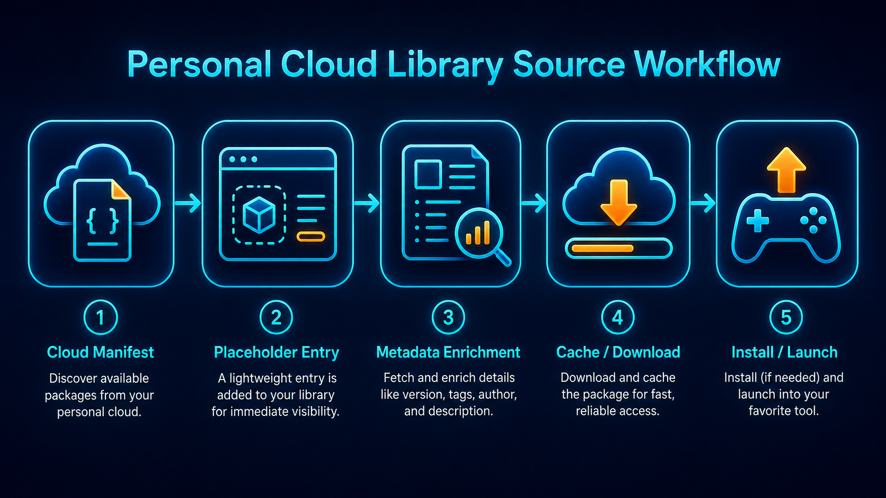
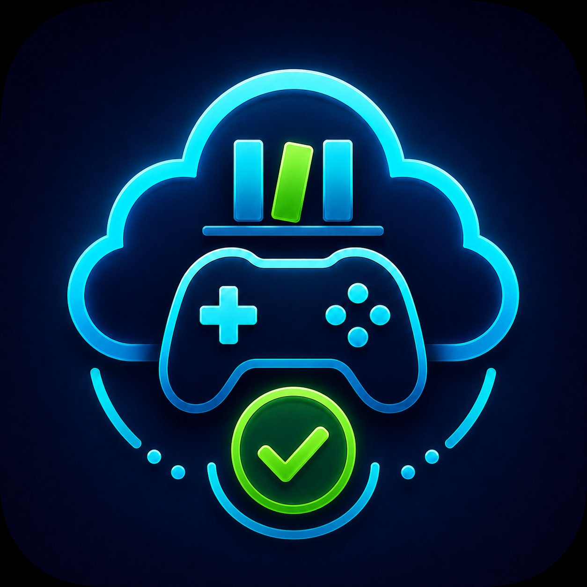
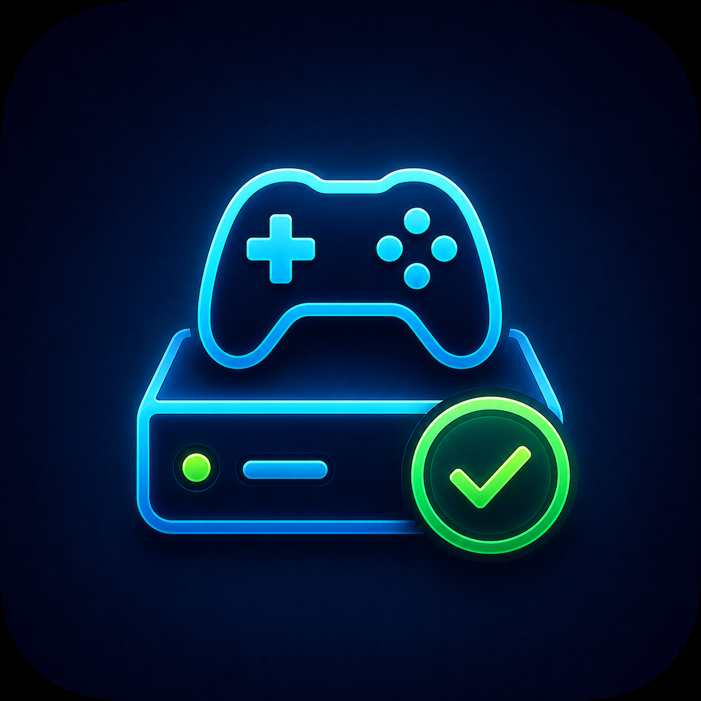

# Personal Cloud Library Source



Personal Cloud Library Source imports a user-supplied cloud, NAS, external-drive, or local manifest into Playnite's normal library view. Cloud-only entries can appear before download, be enriched with Playnite metadata, downloaded/copied to a local cache when needed, launched locally, and later uninstalled from cache while keeping the catalog entry.

## Overview

The plugin catalogs user-supplied entries and copies/downloads user-owned files from configured local folders or rclone remotes.

## How This Works


Personal Cloud Library Source lets users keep a record of their personal cloud/local library inside Playnite. Entries can appear before they are downloaded, so the library can be organized first and cached later.

This supports a download/cache workflow: import entries, enrich them in Playnite, download or copy selected items to a local cache when ready, then launch them locally through Playnite.

This is not a gameplay streaming service. It does not provide games, ROMs, BIOS files, cracks, keys, copyrighted content, scraping, or download sources. It catalogs user-supplied entries and copies/downloads user-owned files from configured local folders or rclone remotes.

## Features

- Normal Playnite `GameLibrary` integration.
- Provider modes for `LocalFile`, `LocalFolder`, and `RcloneRemote`.
- Local folder, external drive, mounted drive, and NAS support.
- Google Drive, OneDrive, Dropbox, and other cloud providers through rclone.
- Cloud-only entries imported as uninstalled.
- Cached entries imported as installed with a Play action.
- Manual `Download to local cache` action when a provider can resolve `sourcePath`.
- Manual `Remove cached copy` action for installed/cached entries.
- Optional import diagnostics.
- Customizable library display name inside Playnite.

## Playnite Metadata

Imported entries behave like normal Playnite library entries. After import, users can use Playnite's existing metadata download tools and metadata providers to add covers, descriptions, genres, screenshots, and other details.

Metadata can be prepared before downloading or installing the actual file, as long as the entry exists in Playnite. Cached or downloaded entries can then launch normally.

## What This Plugin Does Not Provide

This is not a gameplay streaming service. It does not provide games, ROMs, BIOS files, cracks, keys, copyrighted content, scraping, or download sources. It catalogs user-supplied entries and copies/downloads user-owned files from configured local folders or rclone remotes.

## Installation for Users

The recommended way to install **Personal Cloud Library Source** is through Playnite’s official add-on database.

1. Open Playnite.
2. Go to **Main Menu → Add-ons**.
3. Open **Browse**.
4. Search for **Personal Cloud Library Source**.
5. Select the add-on and click **Install**.
6. Restart Playnite when prompted.
7. Open the plugin settings and choose a provider mode.
8. Run **Update Game Library**.


The provider settings choose where the manifest is read from. The cache settings choose where files are downloaded/copied before Playnite launches them.

## Building From Source for Developers

1. Build Debug Any CPU.
2. Add this folder as a Playnite external extension:

   ```text
   D:\PersonalCloudLibrarySource\PersonalCloudLibrarySource\bin\Debug
   ```

3. Restart Playnite.
4. Configure a test manifest and run `Update Game Library`.

To create a prerelease package:

```powershell
.\tools\package-extension.ps1
```

## Provider Modes

### LocalFile

Reads a manifest from `LocalManifestPath`. If downloads are enabled, `sourcePath` can be absolute or relative to the manifest folder.

### LocalFolder, External Drive, or NAS

Reads a manifest from:

```text
LocalLibraryRoot + ManifestRelativePath
```

Copies item files from:

```text
LocalLibraryRoot + sourcePath
```

### RcloneRemote

Reads a manifest with:

```text
rclone cat remote:manifestPath
```

Copies item files with:

```text
rclone copyto remote:sourcePath localCachePath
```

Use this for Google Drive, OneDrive, Dropbox, and other providers supported by rclone.

## LocalFile Setup

```text
SourceProviderType = LocalFile
LocalManifestPath = D:\PersonalCloudLibrarySource\samples\personal-cloud-library.sample.json
LocalCacheFolder = D:\PersonalCloudLibraryCache
AllowDownloads = true
TreatMissingFilesAsUninstalled = true
EnableDiagnostics = true
```

## LocalFolder, External Drive, or NAS Setup

```text
SourceProviderType = LocalFolder
LocalLibraryRoot = E:\PersonalLibrary
ManifestRelativePath = personal-cloud-library.sample.json
LocalCacheFolder = D:\PersonalCloudLibraryCache
AllowDownloads = true
```

NAS example:

```text
LocalLibraryRoot = \\NAS\PersonalLibrary
```

## Google Drive via Rclone Setup

Configure a Google Drive remote with `rclone config`, then map the plugin settings:

```text
SourceProviderType = RcloneRemote
RcloneExecutablePath = rclone
RcloneRemoteName = google_drive
RcloneManifestPath = PersonalLibrary/personal-cloud-library.sample.json
RcloneContentRoot = PersonalLibrary/files
RcloneTimeoutSeconds = 30
LocalCacheFolder = D:\PersonalCloudLibraryCache
AllowDownloads = true
```

## OneDrive via Rclone Setup

Configure a OneDrive remote with `rclone config`, then use the same `RcloneRemote` settings pattern:

```text
RcloneRemoteName = onedrive
RcloneManifestPath = PersonalLibrary/personal-cloud-library.sample.json
RcloneContentRoot = PersonalLibrary/files
```

## Manifest Setup

Recommended v2 manifests use `sourcePath` for the provider source and `cachePath` for the local cached launch file.

```json
{
  "version": 2,
  "items": [
    {
      "id": "example-adventure",
      "title": "Example Adventure",
      "platform": "Example Platform",
      "sourcePath": "ExampleAdventure/ExampleAdventure.bat",
      "cachePath": "ExampleAdventure\\ExampleAdventure.bat",
      "installDirectory": "ExampleAdventure",
      "launchFile": "ExampleAdventure.bat",
      "notes": "Fake local sample entry for testing."
    }
  ]
}
```

See [docs/manifest-format.md](docs/manifest-format.md).

## Download and Cache Behavior

The plugin never downloads automatically before launch. Missing entries remain visible as uninstalled when `TreatMissingFilesAsUninstalled` is enabled. Use `Download to local cache` manually when `AllowDownloads` is enabled and the provider can resolve `sourcePath`.



Cloud-only entries are catalog entries without a cached local launch file. They can still exist in Playnite, use Playnite metadata, and become playable later after download/copy to local cache.



Cached entries have a local launch file and can launch locally through Playnite.

## Uninstall and Cache Cleanup

Playnite uninstall support removes local cached copies only. It does not remove cloud/source files, does not edit the manifest, and does not remove the Playnite game entry.


By default, uninstall removes the cached install folder under `LocalCacheFolder`. You can change this with:

```text
UninstallBehavior = RemoveCachedInstallFolder
```

Supported values:

- `RemoveCachedFileOnly`
- `RemoveCachedInstallFolder`
- `AskEachTime`

`AllowUninstallOutsideCacheFolder` defaults to `false`. Leave it off unless you intentionally use absolute cache paths outside `LocalCacheFolder`.

After removing the cached copy and updating the library, the manifest entry remains in Playnite as an uninstalled/cloud-only entry. Existing Playnite metadata can remain attached to the entry.

## Screenshots

Public-safe screenshots and visuals are kept under `docs/images/`:

- settings screen
- cloud-only uninstalled item
- installed/cached playable item

## Troubleshooting

See [docs/troubleshooting.md](docs/troubleshooting.md) for common setup and visibility issues.

## Privacy and Legal Use

Personal Cloud Library Source reads user-supplied paths and manifests. It does not include private cloud IDs, native cloud API credentials, or bundled content.

See [docs/legal-use.md](docs/legal-use.md).

## Playnite Add-on Browser Submission

Playnite add-on database submission helpers are kept in `playnite-addon/`.

- Installer manifest: `playnite-addon/installer.yaml`
- Database listing helper: `playnite-addon/addon-database.yaml`

`AddonId` must match `PersonalCloudLibrarySource/extension.yaml` exactly. The repository and release assets must be public for the Playnite add-on browser to install the package. After the add-on database PR is merged, normal users can install the package from Playnite's add-on browser instead of downloading the `.pext` manually.

## Roadmap

- Phase 1: local manifest validation and UI polish.
- Phase 2: provider-based local folder and rclone copy support.
- Phase 3: cache verification/hash checks.
- Phase 4: Playnite add-ons database readiness.
