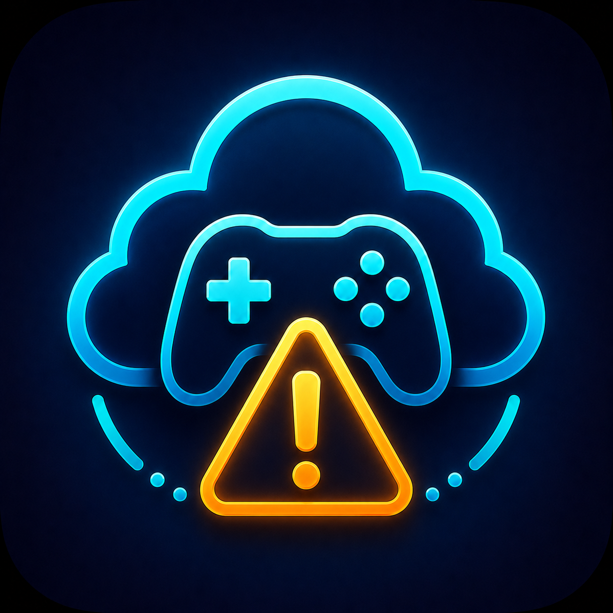
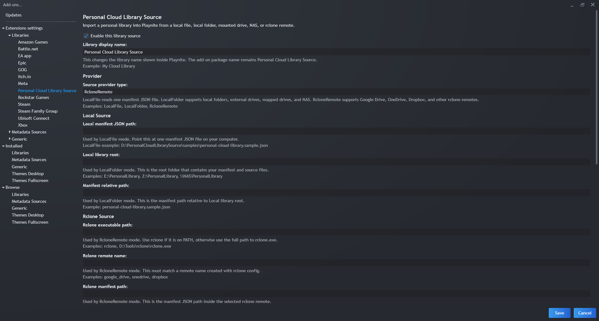
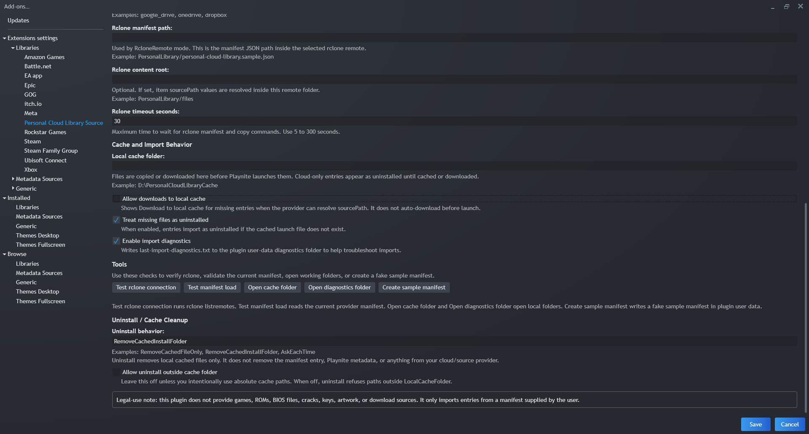

# Troubleshooting



Use diagnostics and the settings screen first when troubleshooting provider paths, cache state, or uninstall behavior.



Provider settings control where the manifest is read from.



Cache and uninstall settings control where files are copied/downloaded and what cached files may be removed.

## I Expected Streaming

Personal Cloud Library Source is not a game-streaming service and does not stream gameplay. It catalogs entries, downloads or copies selected items into a local cache, and launches cached files locally through Playnite.

## rclone is not recognized

Set `RcloneExecutablePath` to the full path of `rclone.exe`, or add rclone to `PATH`.

## Remote manifest path is wrong

Test outside Playnite:

```powershell
rclone cat remote:PersonalLibrary/manifest.json
```

If this fails, update `RcloneRemoteName` or `RcloneManifestPath`.

## JSON BOM or Encoding Issue

Save the manifest as valid UTF-8 JSON. The importer trims a leading UTF-8 BOM, but malformed JSON will fail to load.

## Cloud Item Appears Uninstalled

This is expected when the cached launch file is missing and `TreatMissingFilesAsUninstalled` is enabled. Use `Download to local cache` if the item has a resolvable `sourcePath`.

## Game Appears but Is Uninstalled

The entry exists in Playnite, but the expected local cached launch file does not exist yet. This is normal for cloud-only items. Download or copy it to the local cache when you are ready to launch it.

## Metadata Before Download

Imported entries behave like normal Playnite entries even before the files are cached. You can use Playnite's metadata tools to add covers, descriptions, genres, screenshots, and other metadata first.

## Playnite Filters Hide Uninstalled Games

If diagnostics show the item was returned but Playnite does not show it, check filters and make sure uninstalled games are visible.

## Download Action Not Visible

Confirm:

- `AllowDownloads` is enabled.
- The item has `sourcePath` or legacy `remotePath`.
- The local cached launch file is missing.
- The provider can resolve the source path.
- The game belongs to this plugin.

## Rclone Path Looks Doubled

If `RcloneContentRoot` is set to `PersonalLibrary/files`, item `sourcePath` values should not also start with `PersonalLibrary/files`.

Correct:

```text
RcloneContentRoot = PersonalLibrary/files
sourcePath = Game/Game.exe
```

Incorrect:

```text
RcloneContentRoot = PersonalLibrary/files
sourcePath = PersonalLibrary/files/Game/Game.exe
```

The incorrect setup resolves to `PersonalLibrary/files/PersonalLibrary/files/Game/Game.exe`. Use the manifest validation button to catch this warning.

## Uninstall Did Not Delete Files

Uninstall only removes local cached files or folders. It never deletes the manifest, cloud/source files, or rclone remote content.

Check `UninstallBehavior`:

- `RemoveCachedFileOnly` deletes only the resolved cached launch file.
- `RemoveCachedInstallFolder` deletes the resolved cached install folder.
- `AskEachTime` prompts when Playnite's dialog API is available.

## Uninstall Refused Because Path Is Outside Cache

By default, uninstall is only allowed for paths inside `LocalCacheFolder`. This prevents accidental deletion of source-provider files or unrelated local files.

If you intentionally use absolute cache paths outside `LocalCacheFolder`, enable `AllowUninstallOutsideCacheFolder`.

## Game Still Appears After Uninstall

This is expected. Uninstall removes the cached local copy only. The manifest record remains, Playnite metadata can remain, and the entry should appear as uninstalled after a library update.

## File Launches but Command Window Closes

This is normal for short test `.bat` files. Add a `pause` line to your own test launcher if you need to inspect the output.

## Diagnostics Location

When `EnableDiagnostics` is enabled, diagnostics are written to:

```text
<Playnite plugin user data>\diagnostics\last-import-diagnostics.txt
```

Fallback path:

```text
%LOCALAPPDATA%\PersonalCloudLibrarySource\diagnostics\last-import-diagnostics.txt
```
